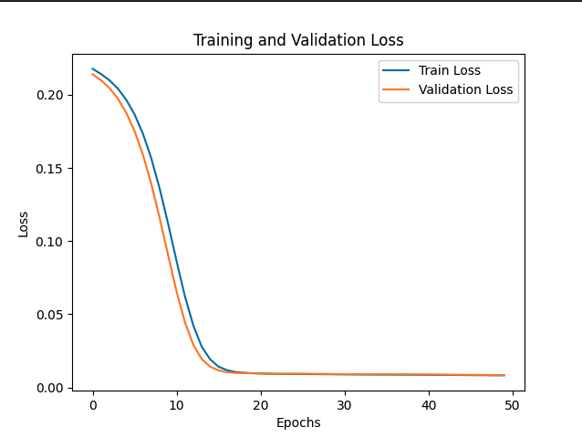

##  Anomaly Detection in NASA Logs using Deep Learning with TensorFlow and Visualization

This project demonstrates how TensorFlow can be used to build a deep learning-based anomaly detection system, with the help of visualization tools like Matplotlib and Plotly. These visualizations give valuable insights into the training process and the detected anomalies.